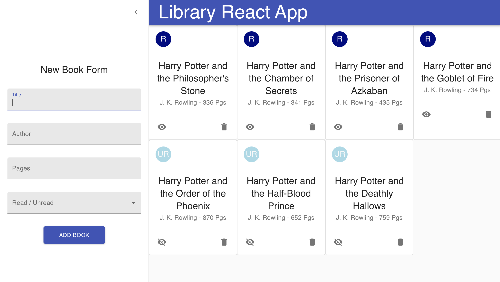

# Library React App

This is a recreated version of the Library Project for the Odin Project done in React. It utilizes React function components, as well as Material-UI components, hooks, and JSS for the styling. 

<a href="https://ricardo-gonzalez-villegas.github.io/library-react-app/">View it here.</a>
<section>
<h2>Technologies Used<h2/>
JSS, Javascript, React, Material-UI
</section>
 
<h1>Home Page</h1>

<h1>Form</h1>

